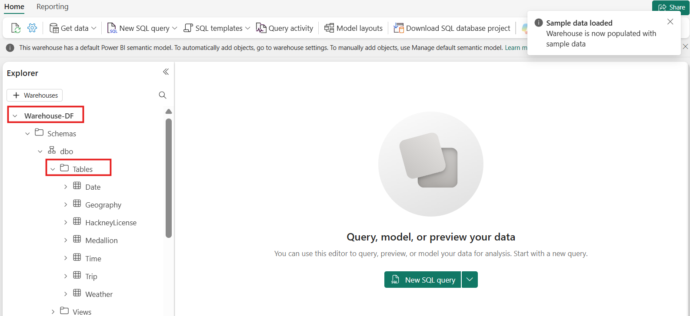
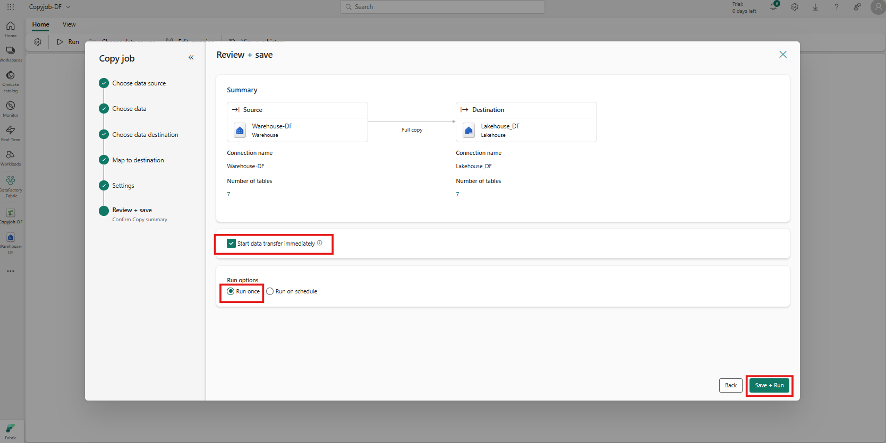
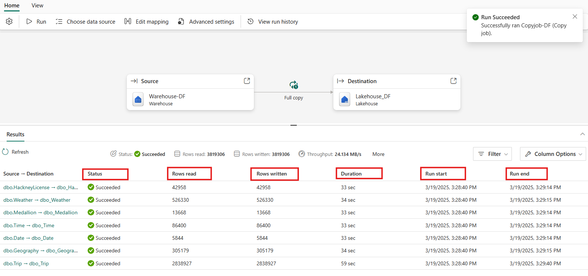
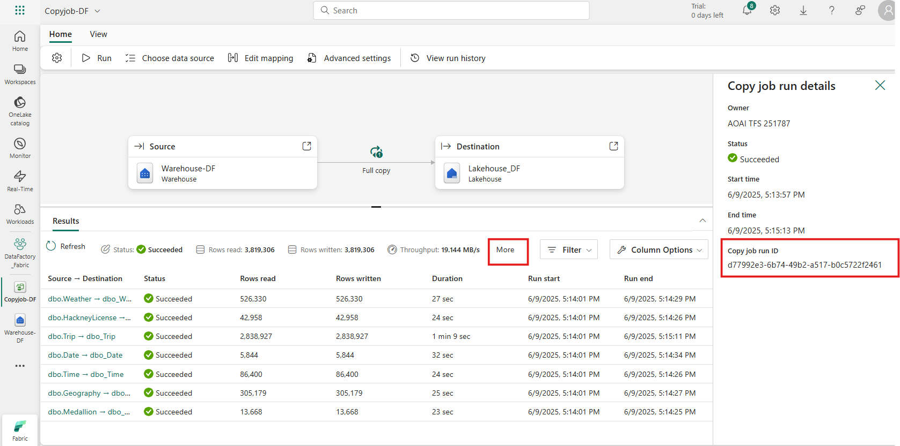
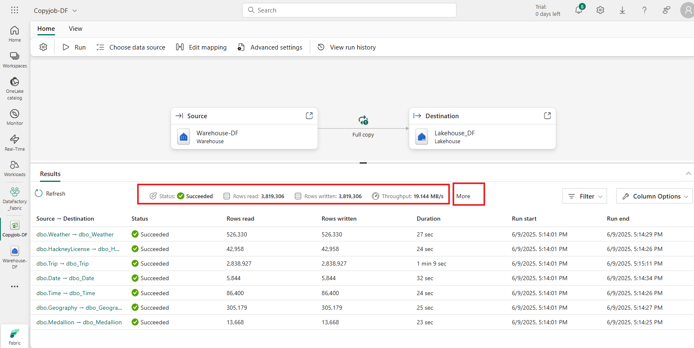
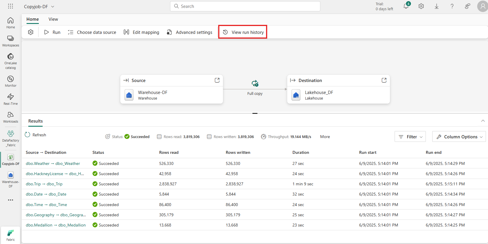

# Use Case 1 – Create and monitor a Copy Job in data factory for Microsoft Fabric

**Overview**

In this lab, you'll learn how to create a **Copy Job pipeline** to
transfer data from a source system (like Azure Data Lake or Warehouse)
to a destination storage — all through a **code-free, visual
interface**. This lab showcases how Copy Jobs can automate and
streamline **data movement across various services**, making it easier
to prepare and deliver data for reporting, analytics, and business
intelligence.

**Objectives**

- Set up a workspace and sample Data Warehouse in Microsoft Fabric.

- Create a no-code Copy Job to move data to a Lakehouse.

- Configure datasets and mappings.

- Run and monitor the Copy Job.

- Review job history and performance.

## Exercise 1 – Setting up the environment.

The objective of this exercise is to guide you through the essential
**environment setup required to create a Copy Job in Microsoft Fabric
Data Factory**. You will learn how to prepare the foundational
components needed to enable smooth data movement and pipeline execution.

Specifically, you will:

- **Create a Microsoft Fabric workspace** to organize and manage your
  data assets.

- **Provision a Data Warehouse** to serve as the source for your Copy
  Job.

### **Task-1: Start a Fabric Capacity Trial**

Follow these steps to start your Fabric capacity trial and become the
Capacity administrator of that trial.

1.  Open your browser and browse the **Microsoft Fabric Trial Page**
    +++https://app.fabric.microsoft.com/+++

2.  In the **Microsoft Fabric** window, enter your given credentials,
    and click on the **Submit** button. 

    

3.  Then, In the **Microsoft** window enter the password and click on
    the **Sign in** button 

    

4.  In **Stay signed in?** window, click on the **Yes** button.

    

5.  On **Fabric Home** page, click on the **Account manager** on the
    right side.

    

6.  In the Account manager, select **Free trial**. If you don't
    see **Free trial** or **Start trial** or a **Trial status**, trials
    might be disabled for your tenant.

    **Note:** If the Account manager already displays **Trial status**,
    you may already have a **Power BI trial** or a **Fabric (Free)
    trial** in progress. To test this out, attempt to use a Fabric
    feature. For more information, see [**Start using
    Fabric**](https://learn.microsoft.com/en-us/fabric/fundamentals/fabric-trial#other-ways-to-start-a-microsoft-fabric-trial).

    

7.  If prompted, agree to the terms and select the appropriate Trial
    capacity region and then select **Activate**.

    

8.  Once your trial capacity is ready, you receive a confirmation
    message. Select **Fabric Home Page** to begin working in Fabric.
    You're now the Capacity administrator for that trial capacity.

    

9.  Open your Account manager again. Notice the heading for **Trial
    status**. Your Account manager keeps track of the number of days
    remaining in your trial.

    

Congratulations. You now have a Fabric trial capacity that includes a
Power BI individual trial (if you didn't already have a Power
BI *paid* license) and a Fabric trial capacity.

### **Task-2: Create a New Workspace**

To create a workspace:

1.  From left pane, select **Workspaces** \> **New workspace**.

    

2.  In the **Create a workspace** tab, enter the following details and
    click on the **Apply** button.

    |   |    |
    |-----|-----|
    |Name|	Enter a unique name. for example – +++DataFactory_Fabric+++|
    |Advanced	|Under License mode, select Trial|
    |Default storage format	|Small semantic model storage format|

    
    
    

    

### **Task-3: Create a Warehouse with sample data** 

1.  In the **DataFactory_Fabric** Workspace
    page, select **+New Item** and Look for the **Sample warehouse**
    card under Store Data section**.**

    

2.  On the **New warehouse** dialog, provide a
    name for your warehouse as +++**Warehouse-DF**+++ and click on the
    **Create** button.

    

3.  The create action creates a new
    **Warehouse** and start loading **sample data** into it. The data
    loading takes few minutes to complete.

    

4.  On completion of loading sample data, the warehouse opens with
    sample data loaded into tables and views to query.

    

## Exercise 2 - Create a Copy job in Data Factory

In this exercise, you will learn how to:

- Define and configure **source and destination datasets.**

- Set up a **Copy activity pipeline** using the intuitive, code-free
  interface.

- Customize settings like **column mappings, data filters, and file
  formats.**

### **Task-1: Create a Copy job in Data Factory**

Complete the following steps to create a new Copy job:

1.  Navigate to the existing workspace i.e., +++**DataFactory_Fabric**+++
    page.

    

2.  Select **+ New item** option and choose the
    **Copy job** card to create a new Copy job.

    

3.  Assign a name to the new job, then select **Create**.

    

4.  For this lab, we are considering
    **Warehouse** as the **data source** which we have created
    initially. Hence, Choose the data stores as **Warehouse-DF** to copy
    data from.

    

5.  Select the **tables** and **columns** you wish to copy by selecting
    the **checkboxes**. You can remove the views represented with a
    different symbol as shown below. Click on **Next**.

    

6.  For this lab, we are considering
    **Lakehouse** as the **data destination**. So, to create a new
    lakehouse for copying the data from the data source to this
    lakehouse using copy job, select your **destination store** as
    **Lakehouse** under **New Fabric** item.

    

7.  Select the **Workspace** name from the
    drop-down and provide a name to the **lakehouse** as
    **Lakehouse_DF**.

    

8.  You can configure table or column
    mapping using **Edit** column mapping option. Here, it is not
    required. Click on **Next** button.

    

9.  Choose the copy mode, either a one-time full data copy, or
    continuous incremental copying. For this lab, we are moving ahead
    with **full copy** option. Click on **Next**.

    

10. Review the **copy** **job summary**
    and save it.

    

11. In the Copy job panel, you can modify,
    execute, and track the job's status. The **inline monitoring** panel
    displays row counts read/written for the latest runs only. The
    successful completion will take 4-5 mins.

    

## Exercise 3 – Monitor a Copy job in Data Factory 

In this exercise, you will learn how to:

- Access and interpret **Copy Job run history.**

- Understand **pipeline run status, errors, and performance metrics.**

- Gain insights into **data volumes, throughput, and execution times.**

### **Task-1: Monitor in the Copy job panel**

Follow these steps to monitor a copy job in copy job panel.

1.  Select **More** to see more details about the job, including the run
    ID, which is useful if you need to create a support ticket.

    
    
    

2.  You can also select **View run history** to see a list of prior
    runs.

    
    
    

### **Task-2: Monitor in the Monitoring Hub**

The Monitoring hub serves as a central portal for overseeing Copy job
runs across different items. There are two ways to access the Monitoring
hub.

1.  When you select the **View run history** button on the Copy job
    panel Results area to view the recent runs for your job, you can
    select **Go to Monitor**.

    

2.  This will navigate you to the **Monitoring
    hub**, where you can see a list of all Copy jobs and their runs.

    

## Summary

Congratulations! You've successfully built and executed a **Copy Job
pipeline in Microsoft Fabric Data Factory**, gaining hands-on experience
with one of the most essential tools for **cloud-scale data movement and
integration**.
