# Use Case 1 – Create and monitor a Copy Job in data factory for Microsoft Fabric

In this lab, you'll learn how to create a **Copy Job pipeline** to
transfer data from a source system (like Azure Data Lake or Warehouse)
to a destination storage — all through a **code-free, visual
interface**. This lab showcases how Copy Jobs can automate and
streamline **data movement across various services**, making it easier
to prepare and deliver data for reporting, analytics, and business
intelligence.

## Exercise 1 – Setting up the Environment

The objective of this exercise is to guide you through the essential
**environment setup required to create a Copy Job in Microsoft Fabric
Data Factory**. You will learn how to prepare the foundational
components needed to enable smooth data movement and pipeline execution.

Specifically, you will:

- **Create a Microsoft Fabric workspace** to organize and manage your
  data assets.

- **Provision a Data Warehouse** to serve as the source for your Copy
  Job.

### **Task-1: Create a New Workspace**

To create a workspace:

1.  From left pane, select **Workspaces** \> **New workspace**.

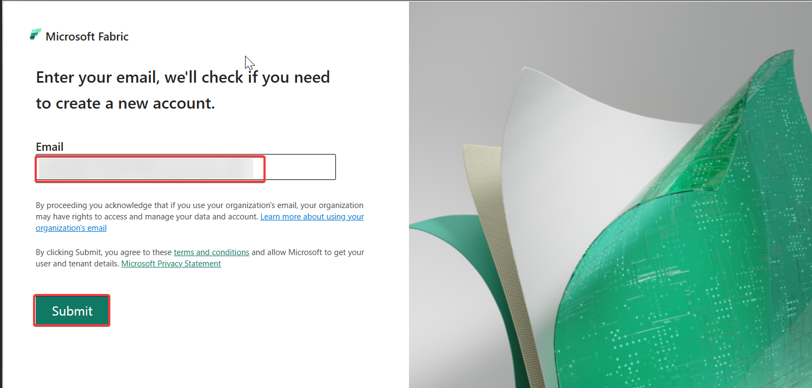

2.  In the **Create a workspace** tab, enter the following details and
    click on the **Apply** button.

[TABLE]

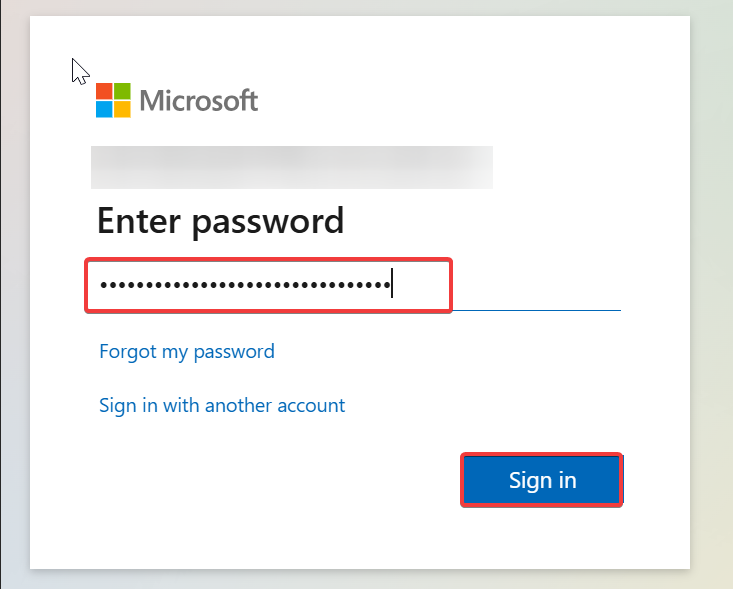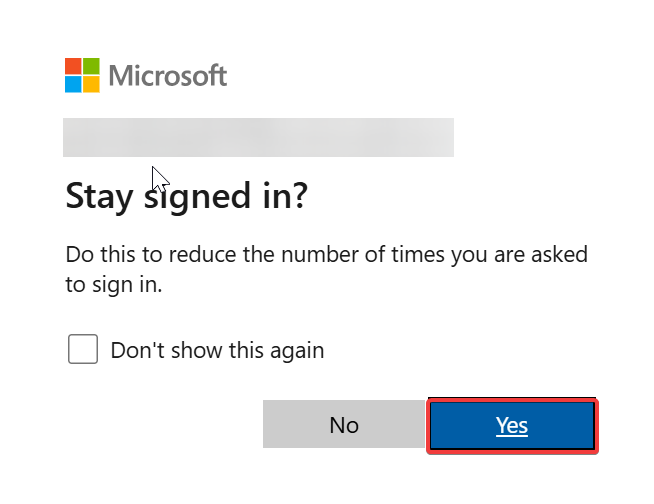

### **Task-2: Create a Warehouse with sample data** 

1.  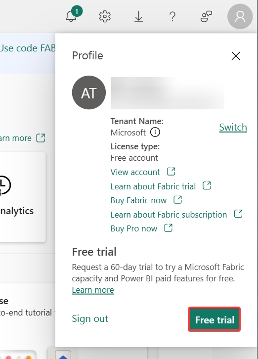In the **DataFactory_Fabric** Workspace page,
    select **+New Item** and Look for the **Sample warehouse** card
    under Store Data section**.**

    
    
2.  On the **New warehouse** dialog, provide a
    name for your warehouse as **Warehouse-DF** and click on the
    **Create** button.

    
    
3.  The create action creates a new Warehouse and
    start loading sample data into it. The data loading takes few
    minutes to complete.

4.  On completion of loading sample data, the warehouse opens with
    sample data loaded into tables and views to query.

    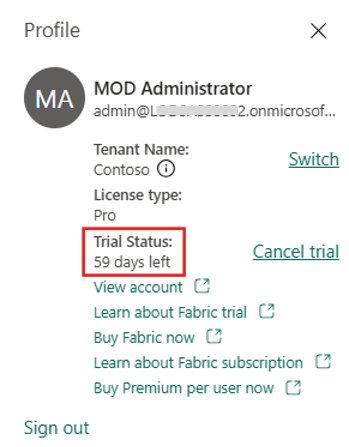

## Exercise 2 - Create a Copy job in Data Factory

In this exercise, you will learn how to:

- Define and configure **source and destination datasets**

- Set up a **Copy activity pipeline** using the intuitive, code-free
  interface

- Customise settings like **column mappings, data filters, and file
  formats**

### **Task-1: Create a Copy job in Data Factory**

Complete the following steps to create a new Copy job:

1.  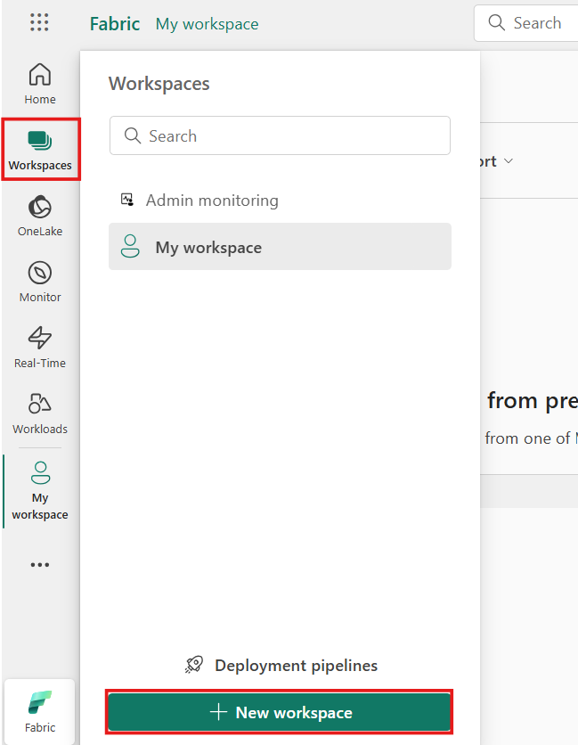Navigate to the existing workspace i.e.,
    Warehouse-DF page.

2.  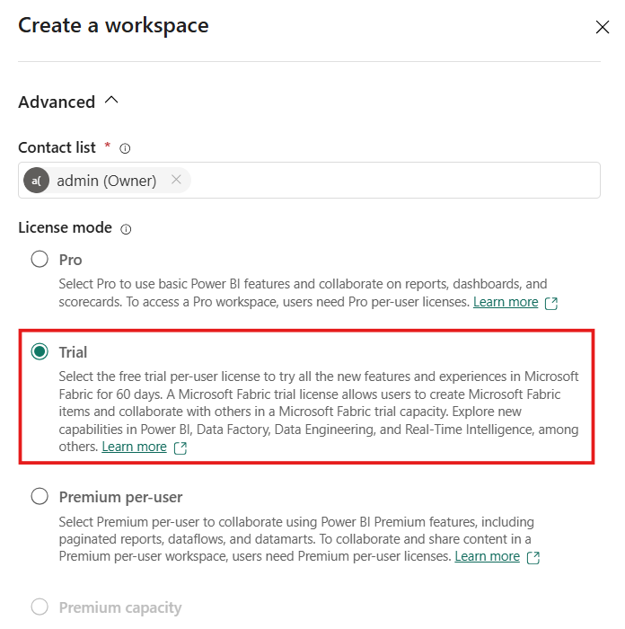Select **+New item** option and choose the
    **Copy job** card to create a new Copy job.

3.  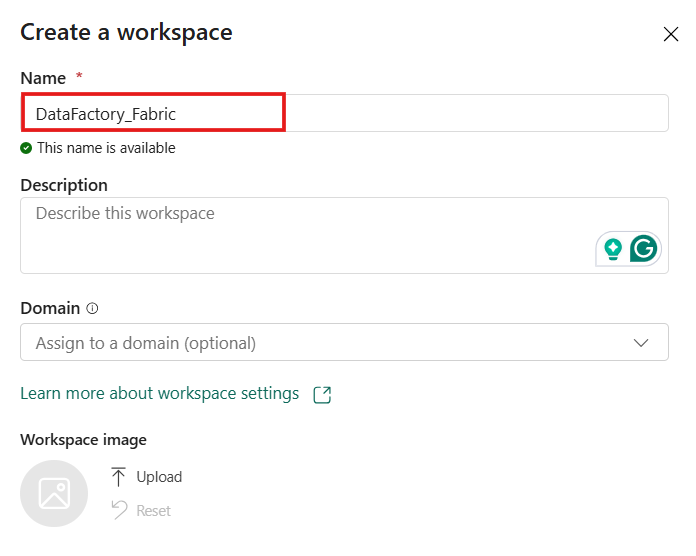Assign a name to the new job, then
    select **Create**.

4.  For this lab, we are considering Warehouse as the data source which
    we have created initially. Hence, Choose the data stores as
    **Warehouse-DF** to copy data from.

5.  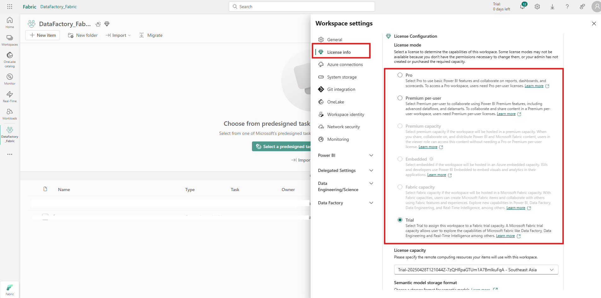Select the tables and columns you wish to
    copy by selecting the **checkboxes**. You can remove the views
    represented with a different symbol as shown below. Click on
    **Next**.

6.  For this lab, we are considering Lakehouse as the data destination.
    So, to create a new **lakehouse** for copying the data from the data
    source i.e, warehouse to this lakehouse using copy job, select your
    **destination store** as **Lakehouse** under New Fabric item.

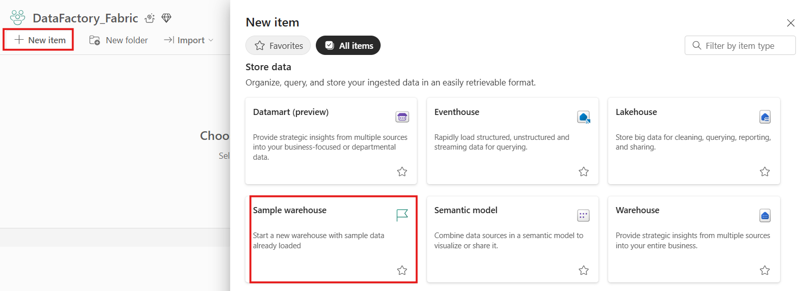

7.  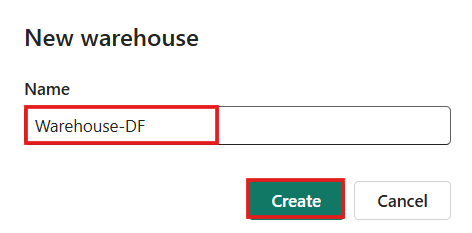Select the **Workspace** name from the
    drop-down and provide a name to the **lakehouse**.

8.  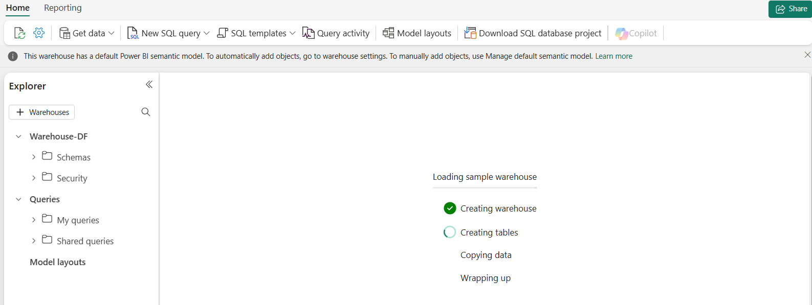Configure table or column mapping if you
    need using **Edit column mapping** option.

9.  Choose the copy mode, either a one-time full
    data copy, or continuous incremental copying. For this lab, we are
    moving ahead with **full copy** option. Click on **Next**.

10. Review the job summary and save it.

11. 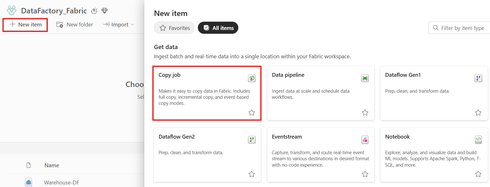In the Copy job panel, you can modify,
    execute, and track the job's status. The inline monitoring panel
    displays row counts read/written for the latest runs only. The
    successful completion will take 4-5 mins.

12. You can also see the data availability in the data destination.

## Exercise 3 – Monitor a Copy job in Data Factory 

In this exercise, you will learn how to:

- Access and interpret **Copy Job run history**

- Understand **pipeline run status, errors, and performance metrics**

- Gain insights into **data volumes, throughput, and execution times**

### **Task-1: Monitor in the Copy job panel**

Follow these steps to monitor a copy job in copy job panel.

1.  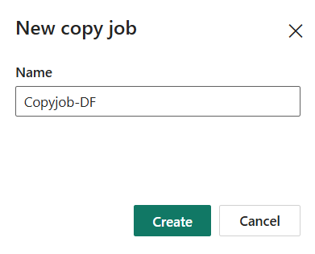Select **More** to see more details about
    the job, including the run ID, which is useful if you need to create
    a support ticket.

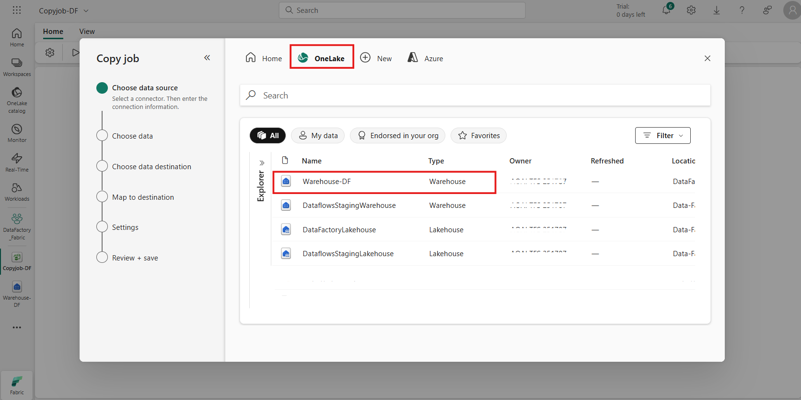

2.  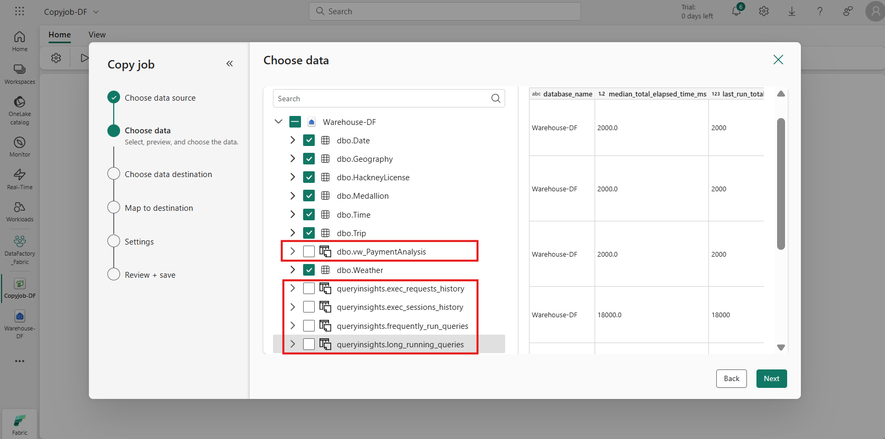You can also select **View run history** to
    see a list of prior runs.

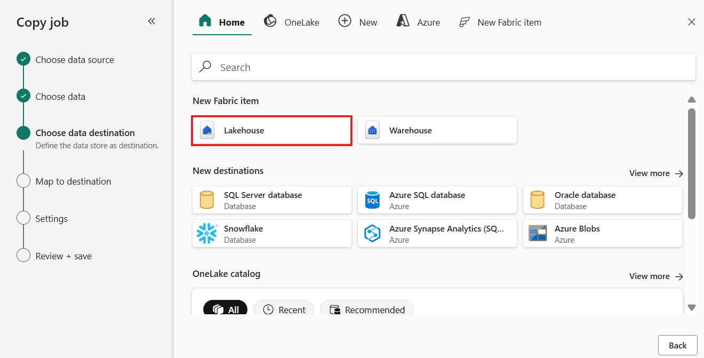

### **Task-2: Monitor in the Monitoring Hub**

The Monitoring hub serves as a central portal for overseeing Copy job
runs across different items. There are two ways to access the Monitoring
hub.

1.  When you select the **View run history** button on the Copy job
    panel Results area to view the recent runs for your job, you can
    select **Go to Monitor**.

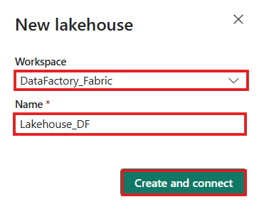

2.  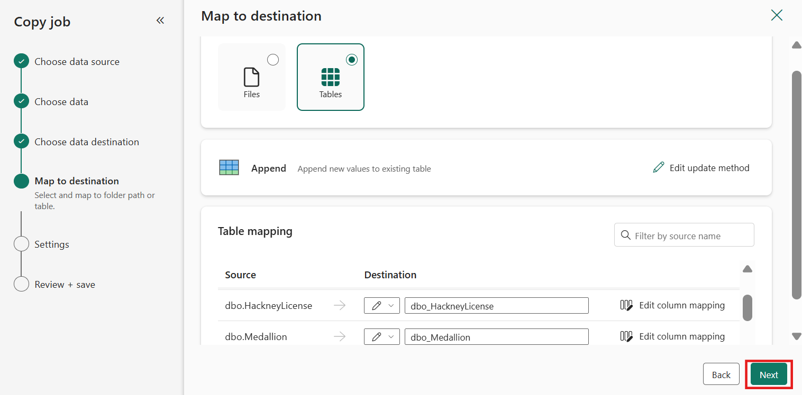This will navigate you to the Monitoring
    hub, where you can see a list of all Copy jobs and their runs.

## Conclusion

Congratulations! You've successfully built and executed a **Copy Job
pipeline in Microsoft Fabric Data Factory**, gaining hands-on experience
with one of the most essential tools for **cloud-scale data movement and
integration**.
