# Use Case 2 – Build a data pipeline to ingest data from Azure Blob Storage to Lakehouse

**Overview**

Contoso faced difficulties in integrating raw CSV data from its
distributed retail stores, which was periodically uploaded to Azure Blob
Storage. Their existing ETL process was manual, time-consuming, and
error prone. The analytics team needed a scalable, automated way to
ingest this data into a centralized Lakehouse to support downstream
Power BI reports and AI workloads. Contoso faced difficulties in
integrating raw CSV data from its distributed retail stores, which was
periodically uploaded to Azure Blob Storage. Their existing ETL process
was manual, time-consuming, and error prone. The analytics team needed a
scalable, automated way to ingest this data into a centralized Lakehouse
to support downstream Power BI reports and AI workloads.

## Exercise 1 – Create a Blob storage account in Azure Portal 

The objective of this exercise is to guide users through the process of
creating a Blob Storage account in the Azure Portal. This includes
selecting the appropriate storage account type, configuring basic
settings such as the resource group, region, and performance options,
and setting up a container to store data. By the end of this exercise,
users will have a functional Azure Blob Storage account ready to be used
as a source to copy a CSV file from an input folder of an Azure Blob
Storage source to a Lakehouse destination.

Follow these steps in Azure portal to create a Blob storage account:

1.  Log in to **Azure Portal** by clicking on this url -
    +++https://portal.azure.com+++ (Please make sure you have a
    subscription before doing all this. If you created a free account
    for the first time, you’ll already have a FREE TRIAL subscription
    for 1 month).

2.  To create a Blob Storage, first you have to
    set up the ‘Storage Account’.  To create one, log in to the Azure
    portal, then click on **Storage Accounts**.

    

3.  The following screen will appear and then
    click on **+** **Create** to proceed further.

    

4.  It will take you to the next page and asks you to fill in the
    following details:

    |   |    |
    |-----|-----|
    |Subscription|	Select your subscription.|
    |Resource group	|Create a new resource group, by clicking on **Create** **new**.|
    |Storage account name|	Specify the name of the account **dpstorage0910**.|
    |Region|	Specify your region or location|
    |Primary service|	Select primary service as **Azure Blob Storage or Azure Data Lake Storage Gen 2.|
    |Performance|	Select **Standard** (general-purpose v2 account)|
    |Redundancy|	Select **Geo-redundant storage (GRS)** for this lab|

    After completing the listed fields, click on **Review + create**.

    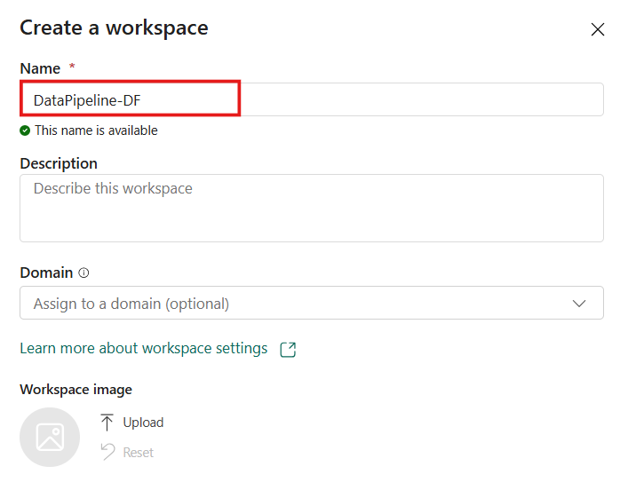

5.  Review all the details and click on **Create**.

    

6.  When you click on **Create**, it will
    navigate you to the next screen that shows the deployment status.
    After Select **Go to resource**.

    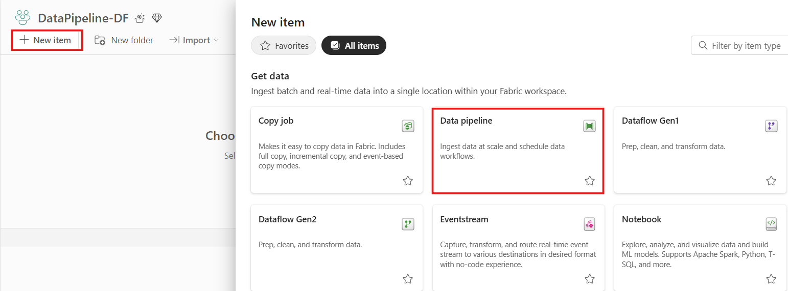

7.  The following screen will appear, showing an
    **Overview** of the created Storage Account. Expand **Data Storage**
    from the left navigation pane and click on **Containers** option.

    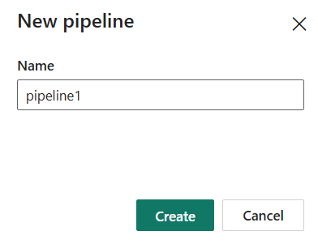

8.  To create a new Container, click on **+
    Container**.

    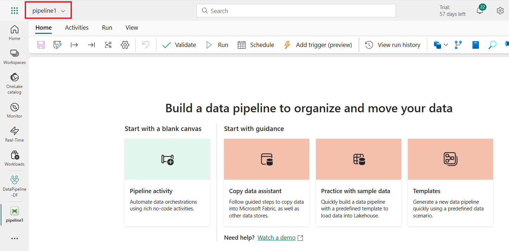

9.  In the **New container** page, enter a name
    for the container i.e., **blobstorage-container** and click on
    **Create**.

    

10. Hence, the blob storage is **successfully**
    **created** as we can see container **blobstorage-container**
    appears under the storage.

    

11. To upload a **Blob object**, navigate to the
    **overview** section of the **storage account** and click on
    **Upload**.

    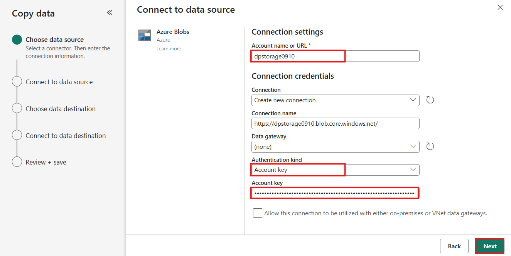

12. Navigate to the **C:\LabFiles** and
    browse for the lab file named as **moviesDB2.csv**. Click on
    **Open** button to upload.

    

13. In the **Upload blob** page, browse for the **moviesDB2.csv** file
    and select the existing container **blobstorage-container** that we
    have just created in the previous steps. Click on **Upload**.

    

14. Again, navigate to the **container** **tab**
    in your storage account (located under data storage in the left
    navigation pane).

    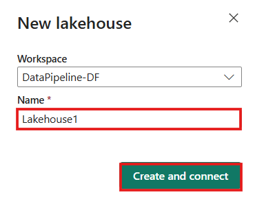

15. There you’ll see the **uploaded file** in the container tab.

    

## Exercise 2 - Create a Data pipeline

The objective of this exercise is to create a Microsoft Fabric workspace
and build a data pipeline that ingests data from Azure Blob Storage into
a Lakehouse. This includes setting up the workspace, and creating a data
pipeline within the workspace.

### **Task-1: Create a New Workspace**

To create a workspace:

1.  From left pane,
    select **Workspaces** \> **New workspace**.

    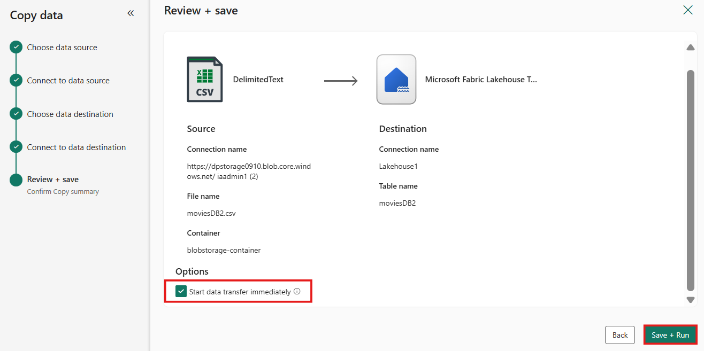

2.  In the Create a workspace tab, enter the following details and click
    on the **Apply** button.

    |   |    |
    |-----|-----|
    |Workspace Name|	+++DataPipeline-DF+++|
    |Semantic Model storage format|	mall semantic model storage format|
    |Capacity	|Under License mode, select Trial|

    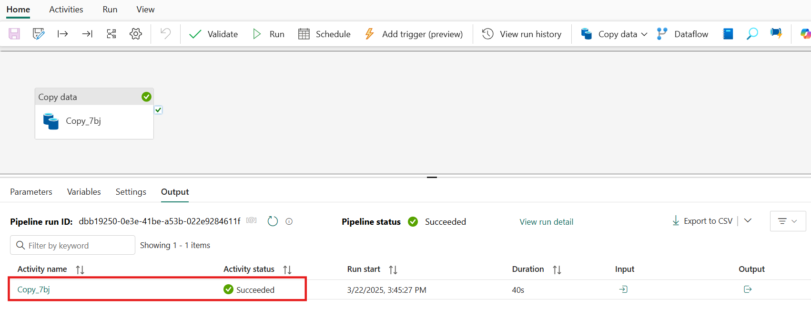

    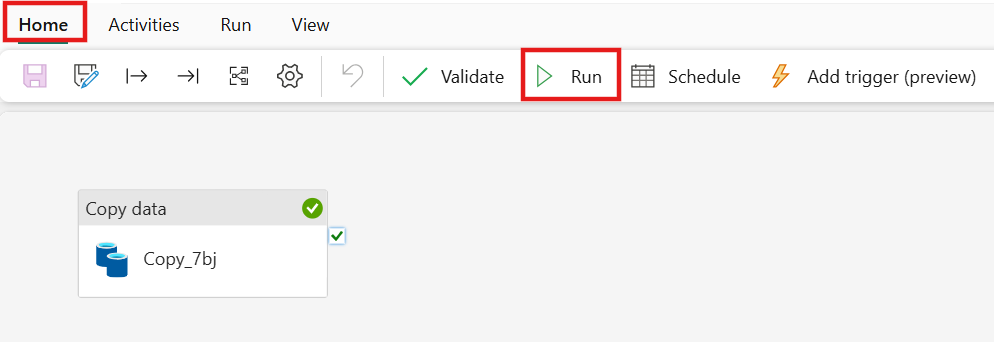

3.  You’ll be navigated to the workspace page.

    

### **Task-2: Create a Data Pipeline**

1.  Click on **+ New item** and select Data
    pipeline card.

    

2.  Provide a name to the pipeline and select **Create**.

    

3.  You’ll be navigated to the **Build a data
    pipeline** page.

    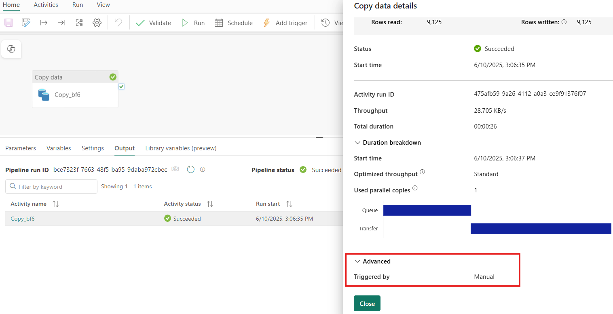

## Exercise 3 – Copy data using the Copy Assistant

The objective of this exercise is to guide users in using the **Copy
Assistant** within a data pipeline in Microsoft Fabric Data Factory to
simplify and accelerate the data copying process. This involves
selecting source and destination data stores, automatically generating
the required Copy Data activity, and executing the pipeline. By
completing these tasks, users will gain hands-on experience with a
streamlined, user-friendly approach to data movement from Azure Blob
Storage to a Lakehouse.

### **Task-1: Start with copy assistant**

Follow these steps to monitor a copy job in the copy job panel.

1.  Select **Copy data assistant** on the canvas
    to open the **copy assistant** tool to get started. Or Select **Use
    copy assistant** from the **Copy data** drop-down list under
    the **Activities** tab on the ribbon.

    

### **Task-2: Configure your source**

1.  Type **blob** in the selection filter, then
    select **Azure Blobs** and select **Next**.

    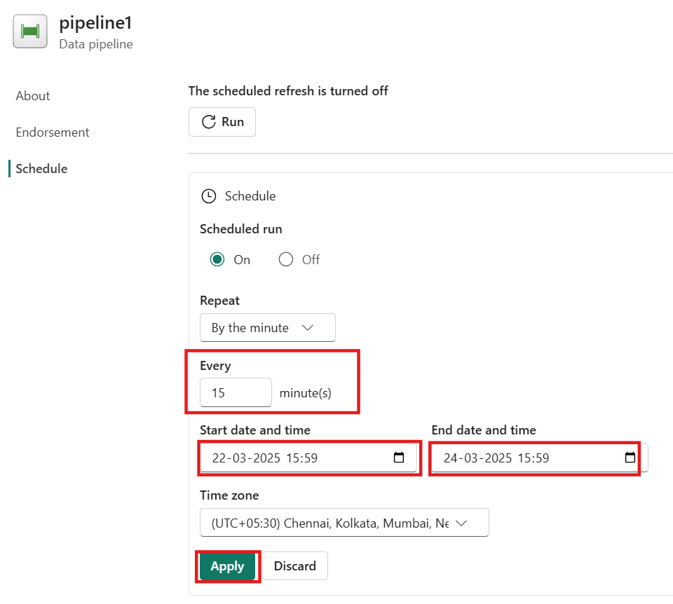

2.  Provide your account name or URL and create a connection to your
    data source by selecting **Create a new connection** under
    the **Connection** drop-down.

-   Specify the **storage account** name in the
    **Account name or URL field**. After selecting **Create new
    connection** with your storage account specified, you only need to
    fill in the **Authentication kind**. In this lab, we preferred the
    **Account key**.

    

-   To find your **Azure Blob Storage account key**, navigate to your
    storage account in the Azure portal, go to **Security + networking**
    and then select **Access keys**. Copy the **Key1 by first clicking
    on it and then, a copy button will be displayed to copy the key**
    and paste it into the **Connect to data source** page in the Fabric
    portal.

    

-   Once your connection is **created successfully**, you only need to
    select **Next** to Connect to a data source.

3.  Choose the file **moviesDB2.csv** in the
    source configuration to preview, and then select Next.

    

### **Task-3: Configure your destination**

1.  Select **Lakehouse**.

    

2.  Provide a name for the new Lakehouse as +++Lakehouse1+++. Then
    select **Create and Connect**.

    

3.  Configure and map your source data to your destination; change the
    load settings to **Load to new table**, then select **Next** to
    finish your destination configurations.

    

### **Task-4: Review and create your copy activity**

1.  Check the checkbox of Start data transfer immediately so that it
    will run directly once the copy activity is added to the data
    pipeline canvas. Review your copy activity settings in the
    previous steps and select Save + run to finish. Or you can go back to
    the previous steps to edit your settings if needed in the tool.

    

2.  Once finished, the copy activity is added to
    your data pipeline canvas and runs directly if you leave the Start
    data transfer immediately checkbox selected. It’ll take 2-3 mins to
    show the status as succeeded.

    

## Exercise 4 – Run and Schedule your data pipeline

The objective of this exercise is to enable users to run and schedule
their data pipeline in Microsoft Fabric Data Factory. This includes
manually triggering the pipeline to verify successful data movement and
configuring a schedule for automated, recurring runs. By the end of this
task, users will understand how to operationalize their data workflows
by setting up reliable and time-based execution of pipelines.

1.  If you didn't leave the Start data transfer
    immediately checkbox on the **Review + Create** page, switch to
    the **Home** tab and select **Run**. Then select **Save and Run**.

    

2.  On the **Output** tab, select the link with
    the name of your Copy activity to monitor progress and check the
    results of the run.

    

3.  The **Copy data** details dialog displays
    the results of the run including status, volume of data read and
    written, start and stop times, and duration.

    

4.  You can also schedule the pipeline to run with a specific frequency as required.
    The following example shows how to schedule the pipeline to run
    every 15 minutes.

    

    

## Summary

By implementing Microsoft Fabric Data Factory, Contoso successfully
modernized its data pipeline infrastructure. This hands-on approach not
only improved operational efficiency but also empowered the analytics
team with timely, trusted data—all without writing a single line of
code. The new solution drastically reduced data ingestion time from
hours to just minutes, allowing for faster data availability.
Additionally, the pipeline's scalability enabled it to handle
high-volume data files seamlessly, supporting the organization’s growing
data needs.
