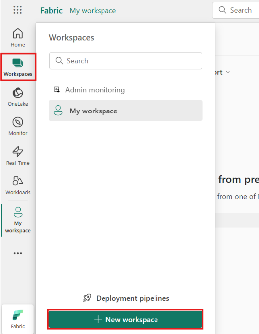
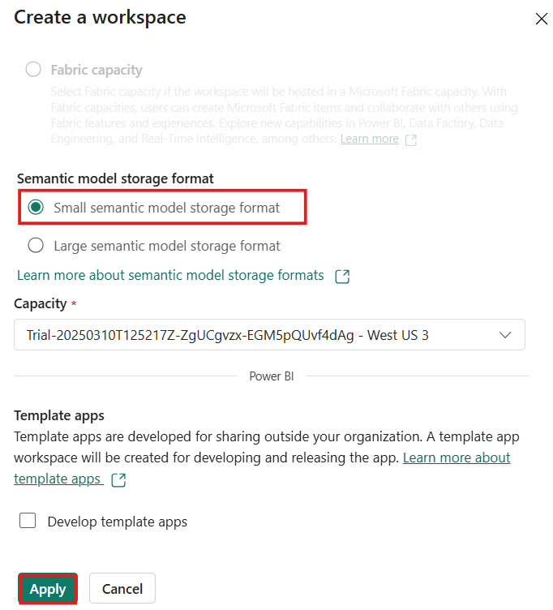
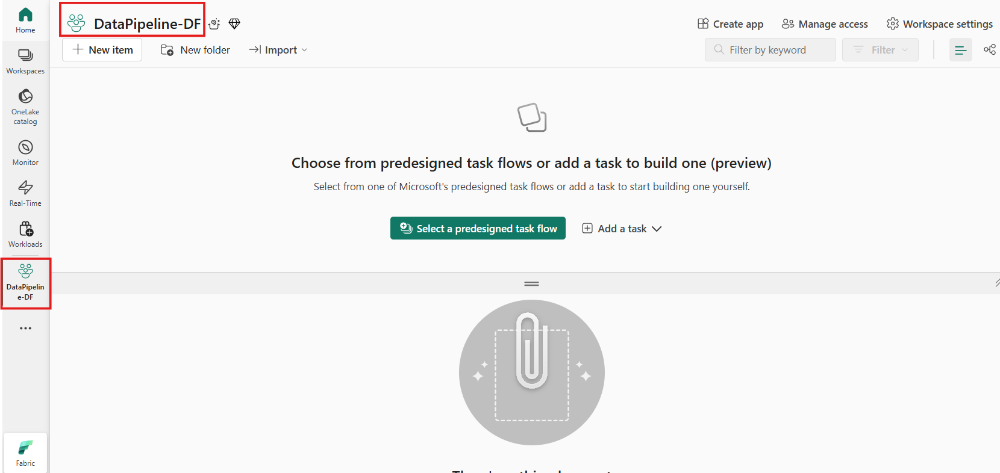
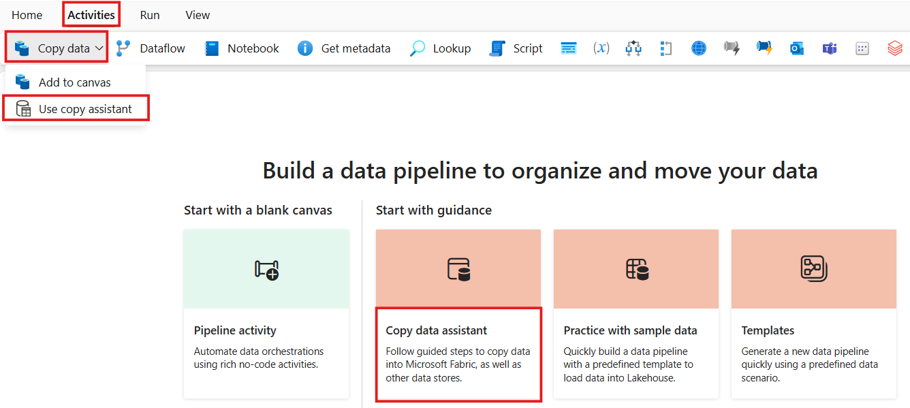
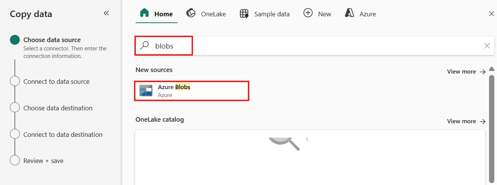
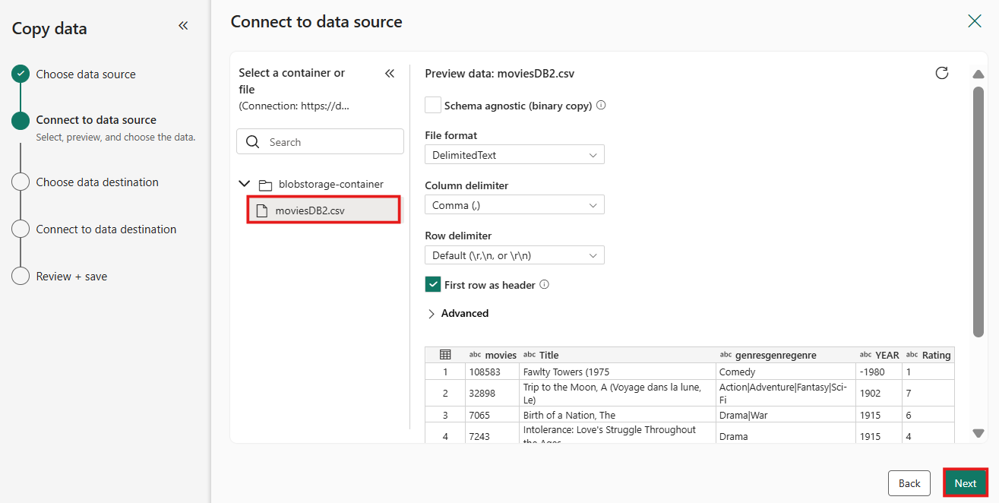
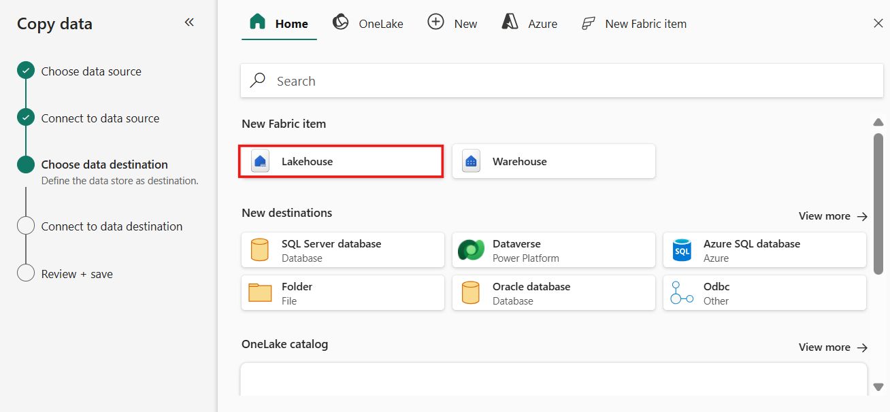
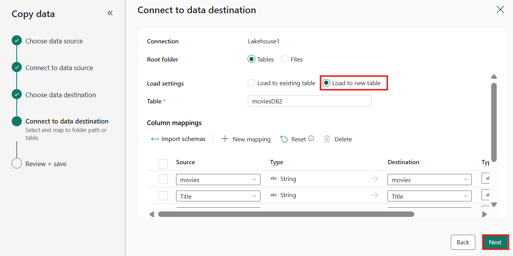
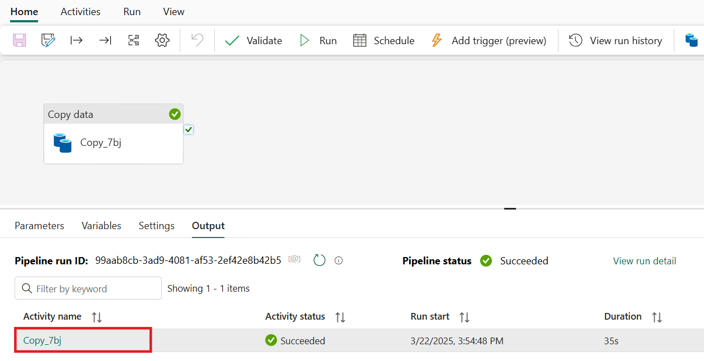
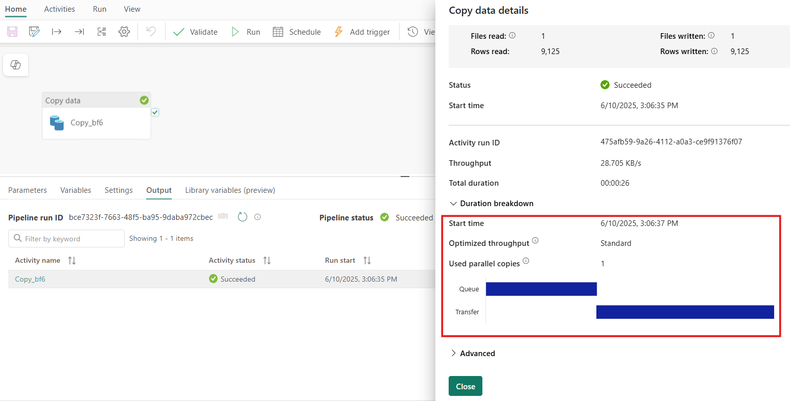

# Use Case 2 – Build a data pipeline to ingest data from Azure Blob Storage to Lakehouse

**Overview**

Contoso faced difficulties in integrating raw CSV data from its
distributed retail stores, which was periodically uploaded to Azure Blob
Storage. Their existing ETL process was manual, time-consuming, and
error prone. The analytics team needed a scalable, automated way to
ingest this data into a centralized Lakehouse to support downstream
Power BI reports and AI workloads. Contoso faced difficulties in
integrating raw CSV data from its distributed retail stores, which was
periodically uploaded to Azure Blob Storage. Their existing ETL process
was manual, time-consuming, and error prone. The analytics team needed a
scalable, automated way to ingest this data into a centralized Lakehouse
to support downstream Power BI reports and AI workloads.

## Exercise 1 - Create a Data pipeline

The objective of this exercise is to create a Microsoft Fabric workspace
and build a data pipeline that ingests data from Azure Blob Storage into
a Lakehouse. This includes setting up the workspace, and creating a data
pipeline within the workspace.

### **Task-1: Create a New Workspace**

To create a workspace:

1.  From left pane,
    select **Workspaces** \> **New workspace**.

    

2.  In the Create a workspace tab, enter the following details and click
    on the **Apply** button.

    - **Workspace name** – DataPipeline-DF

    - **Semantic Model storage format -**Small semantic model storage format

    - **Capacity-** Trial           

    
    
    

3.  You’ll be navigated to the workspace page.

    

### **Task-2: Create a Data Pipeline**

1.  Click on **+ New item** and select Data
    pipeline card.

    

2.  Provide a name to the pipeline and select **Create**.

    

3.  You’ll be navigated to the **Build a data
    pipeline** page.

    

## Exercise 2 – Copy data using the Copy Assistant

The objective of this exercise is to guide users in using the **Copy
Assistant** within a data pipeline in Microsoft Fabric Data Factory to
simplify and accelerate the data copying process. This involves
selecting source and destination data stores, automatically generating
the required Copy Data activity, and executing the pipeline. By
completing these tasks, users will gain hands-on experience with a
streamlined, user-friendly approach to data movement from Azure Blob
Storage to a Lakehouse.

### **Task-1: Start with copy assistant**

Follow these steps to monitor a copy job in the copy job panel.

1.  Select **Copy data assistant** on the canvas
    to open the **copy assistant** tool to get started. Or Select **Use
    copy assistant** from the **Copy data** drop-down list under
    the **Activities** tab on the ribbon.

    

### **Task-2: Configure your source**

1.  Type **blob** in the selection filter, then
    select **Azure Blobs** and select **Next**.

    

2.  Provide your account name or URL and create a connection to your
    data source by selecting **Create a new connection** under
    the **Connection** drop-down.

    1.  Specify the **storage account** name in the **Account name** field as
        +++fabricdatafactory2321+++

    2.  After selecting **Create new connection** with your storage account
        specified, you only need to fill in the **Authentication kind**. In
        this lab, we preferred the **Account key**. Enter the Account key
        as: +++bDDHwLs7sTZ5YP2dYJsSchnEys4a/5mnmSA3NvK/IL1yey7CIy12HU5KeBA7+ZLtKch/N2B5yMHo+AStGvYKpw==+++

        

    3.  Once your connection is **created successfully**, you only need to
        select **Next** to Connect to a data source.

3.  Choose the file **moviesDB2.csv** in the
    source configuration to preview, and then select Next.

    

### **Task-3: Configure your destination**

1.  Select **Lakehouse**.

    

2.  Provide a name for the new Lakehouse. Then
    select **Create and Connect**.

    

3.  Configure and map your source data to your destination; change the
    load settings to **Load to new table**, then select **Next** to
    finish your destination configurations.

    

### **Task-4: Review and create your copy activity**

1.  Check the checkbox of Start data transfer immediately so that it
    will run directly once the copy activity is added to the data
    pipeline canvas.

    Review your copy activity settings in the
    previous steps and select Save + run to finish. Or you can go back to
    the previous steps to edit your settings if needed in the tool.

    

2.  Once finished, the copy activity is added to
    your data pipeline canvas and runs directly if you leave the Start
    data transfer immediately checkbox selected. It’ll take 2-3 mins to
    show the status as succeeded.

    

## Exercise 3 – Run and Schedule your data pipeline

The objective of this exercise is to enable users to run and schedule
their data pipeline in Microsoft Fabric Data Factory. This includes
manually triggering the pipeline to verify successful data movement and
configuring a schedule for automated, recurring runs. By the end of this
task, users will understand how to operationalize their data workflows
by setting up reliable and time-based execution of pipelines.

1.  If you didn't leave the Start data transfer
    immediately checkbox on the **Review + Create** page, switch to
    the **Home** tab and select **Run**. Then select **Save and Run**.

    

2.  On the **Output** tab, select the link with
    the name of your Copy activity to monitor progress and check the
    results of the run.

    

3.  The **Copy data** details dialog displays
    the results of the run including status, volume of data read and
    written, start and stop times, and duration.

    

4.  You can also schedule the pipeline to run with a specific frequency as required.
    The following example shows how to schedule the pipeline to run
    every 15 minutes.

    
    
    

## Summary

By implementing Microsoft Fabric Data Factory, Contoso successfully
modernized its data pipeline infrastructure. This hands-on approach not
only improved operational efficiency but also empowered the analytics
team with timely, trusted data—all without writing a single line of
code. The new solution drastically reduced data ingestion time from
hours to just minutes, allowing for faster data availability.
Additionally, the pipeline's scalability enabled it to handle
high-volume data files seamlessly, supporting the organization’s growing
data needs.
